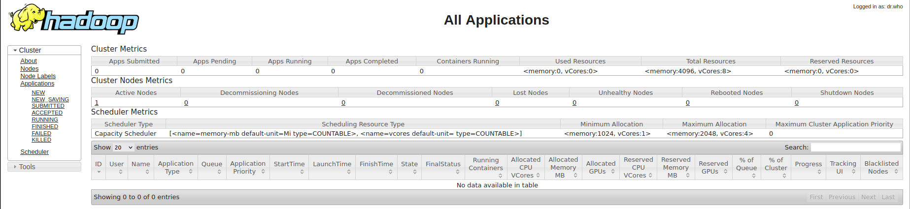
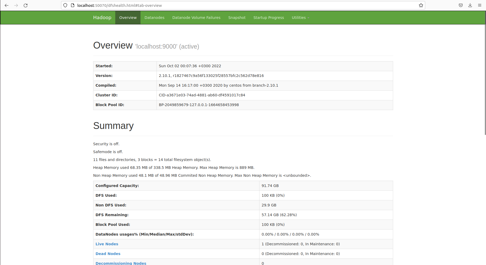
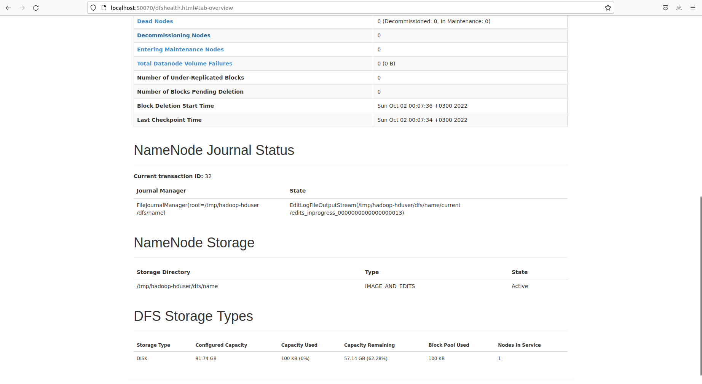
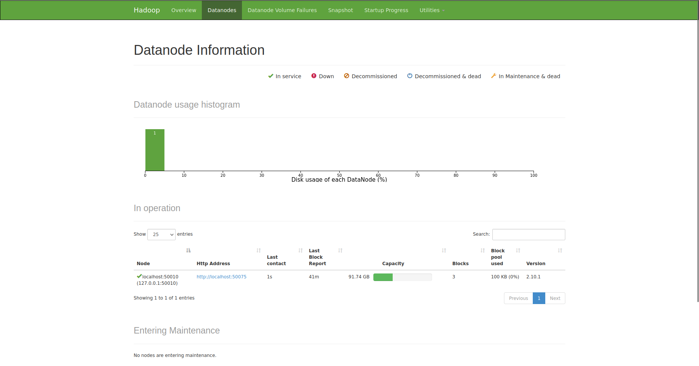
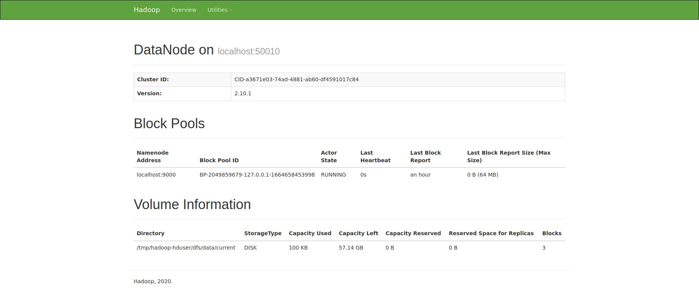

# Практическое задание
## Выполнил Дергунов Никита
Перед выполнение был установлен docker, скачен  docker-образ с hadoop img-hdp-hadoop-20220926T170318Z-001.zip и архив с данными archive.zip
### 1. Разверните у себя hadoop кластер внутри docker контейнера (1 балл) ###
#### Терминал UBUNNU ####
```sh
nikita@nikita-X99:~/Загрузки$ sudo docker ps
[sudo] пароль для nikita: 
CONTAINER ID   IMAGE            COMMAND                  CREATED         STATUS         PORTS                                                                                                                                                                                                                                                                                                                                                                                                                                                                                                          NAMES
134240ae1596   img-hdp-hadoop   "/home/hduser/hadoop…"   3 minutes ago   Up 3 minutes   0.0.0.0:4040->4040/tcp, :::4040->4040/tcp, 22/tcp, 8020/tcp, 8030-8033/tcp, 0.0.0.0:4044->4044/tcp, :::4044->4044/tcp, 8040/tcp, 0.0.0.0:8042->8042/tcp, :::8042->8042/tcp, 0.0.0.0:8088->8088/tcp, :::8088->8088/tcp, 8080/tcp, 9000/tcp, 9864/tcp, 9870/tcp, 10000/tcp, 10020/tcp, 19888/tcp, 50010/tcp, 0.0.0.0:8888->8888/tcp, :::8888->8888/tcp, 0.0.0.0:50070->50070/tcp, :::50070->50070/tcp, 0.0.0.0:50075->50075/tcp, :::50075->50075/tcp, 50020/tcp, 0.0.0.0:50090->50090/tcp, :::50090->50090/tcp   hdp
nikita@nikita-X99:~/Загрузки$ sudo docker cp archive.zip hdp:/home/hduser/
````
### Терминал с HADOOP ####
```sh
hduser@localhost:~$ hdfs dfs -put ppkm /user/hduser/
hduser@localhost:~$ hdfs dfs -ls /user/hduser/
Found 1 items
drwxr-xr-x   - hduser supergroup          0 2022-10-01 21:11 /user/hduser/ppkm
```
### 2. Проверьте работоспособность кластера, посмотрев на статус ресурс менеджера, нейм ноды и дата ноды (1 балл) ###
#### Статус ресурс менеджера ####

#### Статус нэйм ноды ####


#### Статус дата ноды ####



### 3. Поместите датасет ppkm_sentiment у себя в HDFS и дайте всем пользователям на них полные права (1 балл) ###
```sh
hduser@localhost:~$ cd ppkm/
hduser@localhost:~/ppkm$ ls      
ppkm_dataset.csv  ppkm_test.csv  stopwordv1.txt
hduser@localhost:~/ppkm$ hdfs dfs -put ppkm_dataset.csv /user/hduser
hduser@localhost:~/ppkm$ hdfs dfs -ls ppkm_dataset.csv /user/hduser
-rw-r--r--   1 hduser supergroup      43320 2022-10-01 21:56 ppkm_dataset.csv
Found 2 items
drwxr-xr-x   - hduser supergroup          0 2022-10-01 21:11 /user/hduser/ppkm
-rw-r--r--   1 hduser supergroup      43320 2022-10-01 21:56 /user/hduser/ppkm_dataset.csv
hduser@localhost:~/ppkm$ hdfs dfs -chmod 777 /user/hduser/ppkm_dataset.csv
hduser@localhost:~/ppkm$ hdfs dfs -ls ppkm_dataset.csv /user/hduser
-rwxrwxrwx   1 hduser supergroup      43320 2022-10-01 21:56 ppkm_dataset.csv
Found 2 items
drwxr-xr-x   - hduser supergroup          0 2022-10-01 21:11 /user/hduser/ppkm
-rwxrwxrwx   1 hduser supergroup      43320 2022-10-01 21:56 /user/hduser/ppkm_dataset.csv
```
### 4. Определите расположение блоков файла ppkm_dataset.csv в файловой системе (3 балла) ###
Блок blk_1073741828 файл ppkm_dataset.csv, блок blk_1073741825 то же файл ppkm_dataset.csv но который лежит в папке pprm,
это можно понять по времени создания
```sh
hduser@localhost:/tmp/hadoop-hduser/dfs/data/current/BP-2049859679-127.0.0.1-1664658453998/current/finalized/subdir0/subdir0$ ls -l
total 112
-rw-rw-r-- 1 hduser hduser 43320 Oct  1 21:11 blk_1073741825
-rw-rw-r-- 1 hduser hduser   347 Oct  1 21:11 blk_1073741825_1001.meta
-rw-rw-r-- 1 hduser hduser   476 Oct  1 21:11 blk_1073741826
-rw-rw-r-- 1 hduser hduser    11 Oct  1 21:11 blk_1073741826_1002.meta
-rw-rw-r-- 1 hduser hduser  4015 Oct  1 21:11 blk_1073741827
-rw-rw-r-- 1 hduser hduser    39 Oct  1 21:11 blk_1073741827_1003.meta
-rw-rw-r-- 1 hduser hduser 43320 Oct  1 21:56 blk_1073741828
-rw-rw-r-- 1 hduser hduser   347 Oct  1 21:56 blk_1073741828_1004.meta
```
### 5. У вас 20 файлов, каждый размером 130 мб. Сколько блоков будет аллоцировано в NameNode, при условии, что размер блока по умолчанию у вас 128 мб, а фактор репликации равен 3? (2 балла) ###
На каждый файл по 2 блока по 128 мб => файл занимает 256 мб так как фактор репликации 3 то файл будет занимать 768 мб,
фалов 20 => все файлы на дата нодах занимают 15360 мб, получается будет аллоцировано 120 блоков. 
### 6. У вас 1 файл, размером 1.56 Тб. Сколько блоков будет аллоцировано в NameNode, при условии, что размер блока по умолчанию у вас 128 мб, а фактор репликации равен 3? (2 балла) ###
1.56 Тб это 1635779 мб (с округлением вверх) занимает 12800 блоков, так как фактор репликации 3 
всего аллоцировано 38400 блоков